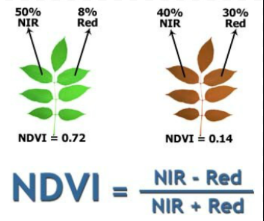

# Index Processor

Index Processor is a pilot repository for solving common Remote Sensing problems. In this assignment, the creation of NDVI and NDWI indices and most importantly the masking from water bodies were studied.

---
## AIM

Main aim is masking the water bodies after calculating the NDVI, NDWI indexes without using any additional libraries like rasterio, earthpy

Secondly, achieving an understanding of Remote Sensing problems with the Computer Science aspect applications.

---
## Theoretical Background

- Normalized difference vegetation index (NDVI)

The formula of NDVI, 



Resource of the picture: https://www.civilsdaily.com/news/normalized-difference-vegetation-index-ndvi/

- Normalized difference water index (NDWI)

In order to calculate NDWI, there is two approach. In this project, the NDWI formulation stated by McFeeter(1996) is used.


Resource of the picture: https://en.wikipedia.org/wiki/Normalized_difference_water_index

In theoretical knowledge of Remote Sensing dicipline, about Near Infrared bands does not reflect from the water bodies. In order to benefit from it a condition has been defined.

However in practical, it does not work everytime. There is two explanations to answer that,

- In Geomatics Engineering diciplined explanation is, because of the effects of another factors such as atmosphere, pixel values of the NIR values are not zero always. Hence, NIR band of Landsat 8 and Sentinel 2 MSI examined and a threshold value is used rather than zero.

- In the aspect of Computer Science these satellite image files can be stored in many kinds of formats and data structures such as unint8 and float32. Hence, the datatype and also the shape of the satellite data needs to be investigated.

---
## How to Install?

In this repository following libraries are used and needs to be installed,

- matplotlib 
- skimage
- tifffile

To install the repository from Terminal through using Git,

```git clone git@github.com:berkesenturk/index_creator.git```

---
## How to use? 

The functions are compatible with Landsat 8 and Sentinel 2 satellite data and also compatible with Tiff and GeoTiff data formats.
 
To use the repository it needs to be installed and runned within the same directory.

To conduct index calculations within the arrays of the image, corresponding bands needs to be introduced. After that the functions can be called as follows,

---
## Example for NDVI

```python
utils.create_ndvi(red_band=<The-location-of-the-green-band>,nir_band=<The-location-of-the-green-band>)
```

However, the output will not satisfy the user because water bodies are needed to be masked.

- To mask water bodies for Landsat 8 satellite image,

```python

utils.water_mask_ndvi_for_landsat_8(ndvi_band=<Use the variable after the calculation of the NDVI>,nir_band=<The-location-of-the-green-band>)
```

- Or, to mask water bodies for Sentinel 2 satellite image,

```python
utils.water_mask_ndvi_for_sentinel_2(ndvi_band=<Use the variable after the calculation of the NDWI>,nir_band=<The-location-of-the-nir-band>)
```
---
## Example for NDWI

```python
utils.create_ndwi(green_band=<The-location-of-the-green-band>,nir_band=<The-location-of-the-NIR-band>)
```

However, the output will not satisfy the user because water bodies are needed to be masked.

- To mask water bodies for Landsat 8 satellite image,

```python
utils.water_mask_ndvi_for_landsat_8(ndwi_band=<Use the variable after the calculation of the NDWI>,nir_band=<The-location-of-the-nir-band>)
```

- Or, to mask water bodies for Sentinel 2 satellite image,

```python
utils.water_mask_ndvi_for_sentinel_2(ndwi_band=<Use the variable after the calculation of the NDWI>,nir_band=<The-location-of-the-nir-band>)
```
---
## Data Retrieval

If you are not satisfied the training data and also you want to contribute the project, you may use ```data_download_script_from_gee``` which coded in javascript language. However this script should be used within Google Earth Engine(GEE) Platform.

If you don't want to use script and connect to GEE easily you can use this link and you may use the same code without losing time :)

```https://code.earthengine.google.com/?accept_repo=users/berkesenturk11/data_downloader```

---
## Compatible Data Sources

Every satellite data product like Landsat 8, Sentinel 2 images has a different purposes for using them. That's why their spectral bands combinations are also different. 

In order to calculate indexes correctly you should use the convenient bands to have an accurate result.

- For Landsat 8 band commbinations as follows,


- For Sentinel-2 MSI: MultiSpectral Instrument, Level-1C,


---
## How you can contribute?

To debug the bugs or if you see any mistake in the project in order to get quick response and contribute also my development, it is better for you please create an issue. We grow from our mistakes :).

